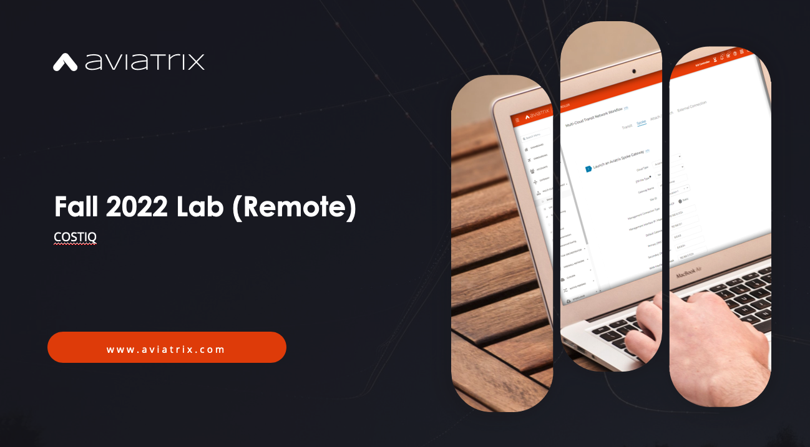
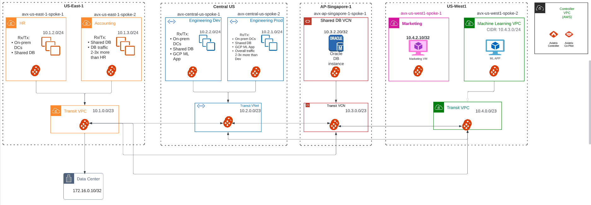

# avx-field-lab-costiq



## Description

This terraform module is the basis for the CostIQ field lab.

## Prerequisites

This module requires a deployed Aviatrix Controller with accounts onboarded for AWS, Azure, GCP, and OCI.

## Infrastructure

  
_Fig. Network Topology_  

## Usage Example

```terraform
module "field_lab_costiq" {
  source               = "github.com/jb-smoker/avx-field-lab-costiq"
  aws_account          = "onboarded aws account name"
  azure_account        = "onboarded azure account name"
  gcp_account          = "onboarded gcp account name"
  oci_account          = "onboarded oci account name"
  workload_password    = "password for the workload instances"
  oci_compartment_ocid = "oci compartment ocid"
  common_tags = {
    Repository = "github.com/jb-smoker/avx-field-lab-costiq"
  }
}

provider "aviatrix" {
  username      = "controller username"
  password      = "controller password"
  controller_ip = "controller ip or dns name"
}

provider "aws" {
  region  = "us-east-1"
}

provider "azurerm" {
  features {}
  subscription_id = "azure subscription id"
  client_id       = "azure client id"
  client_secret   = "azure client secret"
  tenant_id       = "azure directory id"
}

provider "oci" {
  region              = "ap-singapore-1"
  tenancy_ocid        = "oci tenant id"
  auth                = "APIKey"
  config_file_profile = "oci config profile"
}

provider "google" {
  credentials = "gcp credentials file"
  project     = "gcp project"
  region      = "us-west1"
}

terraform {
  required_providers {
    aviatrix = {
      source  = "aviatrixsystems/aviatrix"
      version = ">= 2.24.0"
    }
    aws = {
      source = "hashicorp/aws"
    }
    azurerm = {
      source  = "hashicorp/azurerm"
    }
    google = {
      source = "hashicorp/google"
    }
    oci = {
      source  = "hashicorp/oci"
    }
  }
  required_version = ">= 1.2.0"
}

```

## Variables

The following variables are required:
key | value
:--- | :---
aws_account | The label given to the `AWS` account credential in the Aviatrix Controller
azure_account | The label given to the `Azure` account credential in the Aviatrix Controller
gcp_account| The label given to the `GCP` account credential in the Aviatrix Controller
oci_account | The label given to the `OCI` account credential in the Aviatrix Controller
workload_password | Ssh password for the workload (traffic-generating) instances in each spoke
oci_compartment_ocid | Compartment ocid in the `OCI` tenant configured in the `OCI` provider

## Notes

Intentionally blank
